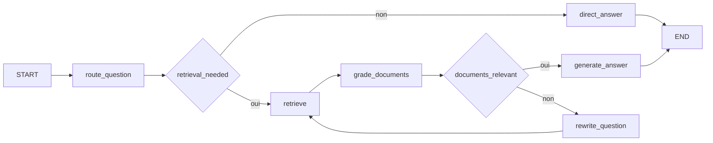

# TP4 - LangGraph et Chatbot Agentic RAG

Ce projet contient deux parties :

1. Une demo des concepts de base LangGraph : etat, noeuds, aretes, aretes conditionnelles et compilation du graphe.
2. Un chatbot Agentic RAG avec LangGraph, testable dans LangGraph Studio et via une interface Streamlit.

## Installation

```powershell
python -m venv .venv
.\.venv\Scripts\Activate.ps1
pip install -r requirements.txt
Copy-Item .env.example .env
```

Ajoutez une cle `OPENAI_API_KEY` dans `.env` pour activer les reponses generees par LLM. Sans cle API, l'application fonctionne en mode local extractif.

Note Windows : si la commande `langgraph` n'est pas reconnue apres installation, ajoutez ce dossier au `PATH` ou appelez l'executable directement :

```powershell
$env:PYTHONIOENCODING = "utf-8"
& "$env:APPDATA\Python\Python314\Scripts\langgraph.exe" dev
```

Pour un environnement plus stable avec LangChain/LangGraph, Python 3.11 a 3.13 est recommande. Python 3.14 peut afficher un avertissement Pydantic sans bloquer les scripts de ce projet.

## Partie 1 - Concepts de base

```powershell
python -m langgraph_rag.simple_graph
```

Le graphe illustre :

- `StateGraph` pour declarer un etat partage.
- Des noeuds Python qui lisent l'etat et retournent des mises a jour.
- `START` et `END`.
- Une arete conditionnelle pour choisir une branche selon le score calcule.

## Partie 2 - Agentic RAG

L'agent suit ce workflow :



## Tester avec LangGraph Studio

```powershell
langgraph dev
```

Le serveur local expose les graphes sur `http://127.0.0.1:2024`. Ouvrez ensuite le lien Studio affiche par la commande et selectionnez le graphe `agentic_rag`.

Exemple d'entree :

```json
{
  "question": "Comment LangGraph gere les noeuds et les aretes conditionnelles ?"
}
```

## Interface web Streamlit

```powershell
streamlit run streamlit_app.py
```

L'interface permet de poser des questions, d'afficher les sources retrouvees, et de visualiser les etapes de raisonnement du graphe.
