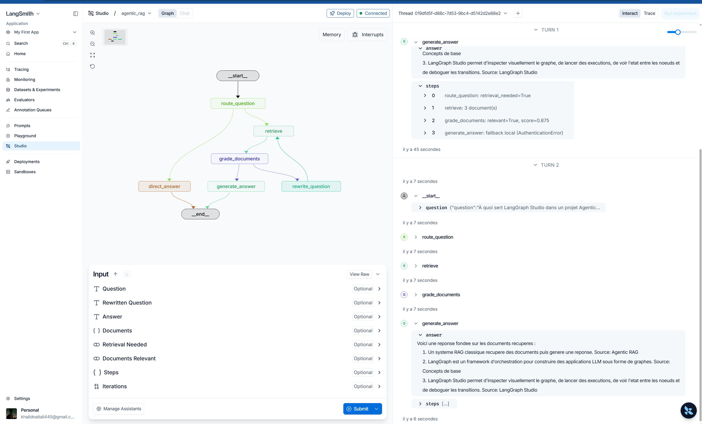
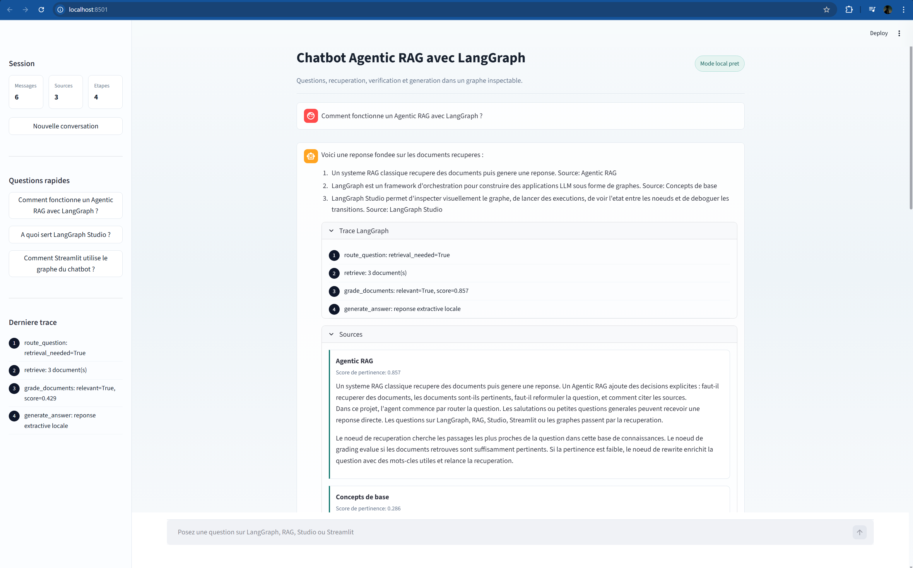
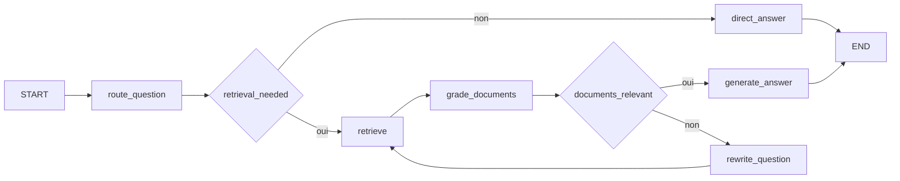

# TP4 - LangGraph et Chatbot Agentic RAG

Ce depot contient un TP complet en 2 parties :

1. Une demo des concepts fondamentaux LangGraph (`StateGraph`, etat partage, noeuds, aretes, aretes conditionnelles, compilation et execution).
2. Un chatbot Agentic RAG avec LangGraph, testable dans LangGraph Studio et via une interface Streamlit.

## Objectifs pedagogiques

- Comprendre la construction d'un graphe d'etat avec LangGraph.
- Implementer une logique Agentic RAG (routing, retrieval, grading, rewrite, generation).
- Visualiser les transitions et les etats dans LangGraph Studio.
- Exposer un chatbot web simple avec Streamlit.

## Captures d'ecran

### LangGraph Studio



### Interface Streamlit



## Structure du projet

```text
.
|-- README.md
|-- requirements.txt
|-- pyproject.toml
|-- langgraph.json
|-- streamlit_app.py
`-- langgraph_rag/
    |-- __init__.py
    |-- simple_graph.py
    |-- agent.py
    |-- retriever.py
    `-- knowledge_base.md
```

## Fichiers importants

- `README.md` : documentation generale du TP.
- `requirements.txt` : dependances Python.
- `langgraph.json` : declaration des graphes exposes a LangGraph Studio.
- `streamlit_app.py` : interface web Streamlit.
- `langgraph_rag/` : logique metier (graphe simple + agent RAG + retriever + base de connaissances).

## Prerequis

- Windows 10/11
- Python 3.11, 3.12 ou 3.13 recommande
- PowerShell

## Installation (Windows)

```powershell
cd C:\Users\HUAWEI\Downloads\tp4langghraph

python -m venv .venv
.\.venv\Scripts\Activate.ps1

python -m pip install --upgrade pip
pip install -r requirements.txt

Copy-Item .env.example .env
```

Configuration `.env` :

```env
OPENAI_API_KEY=
OPENAI_MODEL=gpt-4.1-mini
LANGSMITH_TRACING=false
```

Notes :

- Si `OPENAI_API_KEY` est vide, le projet fonctionne en mode local extractif (sans appel LLM externe).
- Si la cle est invalide, le projet bascule automatiquement en fallback local dans `generate_answer`.

## Partie 1 - Concepts de base LangGraph

Script : `langgraph_rag/simple_graph.py`

Execution :

```powershell
python -m langgraph_rag.simple_graph
```

Ce script montre :

- Un etat partage (`DemoState`).
- Un noeud d'analyse (`analyser_sujet`).
- Une decision conditionnelle (`choisir_branche`).
- Deux branches de sortie (`expliquer_langgraph` ou `reponse_generale`).

## Partie 2 - Chatbot Agentic RAG

Scripts : `langgraph_rag/agent.py`, `langgraph_rag/retriever.py`, `langgraph_rag/knowledge_base.md`

Execution console :

```powershell
python -m langgraph_rag.agent
```

Workflow Agentic RAG :



## Tester avec LangGraph Studio

Lancer le serveur local :

```powershell
$env:PYTHONIOENCODING="utf-8"
.\.venv\Scripts\langgraph.exe dev --no-browser
```

Si la commande ci-dessus n'est pas disponible :

```powershell
$env:PYTHONIOENCODING="utf-8"
& "$env:LOCALAPPDATA\Packages\PythonSoftwareFoundation.Python.3.12_qbz5n2kfra8p0\LocalCache\local-packages\Python312\Scripts\langgraph.exe" dev --no-browser
```

Ouvrir Studio :

- URL standard : `https://smith.langchain.com/studio/?baseUrl=http://127.0.0.1:2024`
- Graphe a selectionner : `agentic_rag`

Exemple d'entree :

```json
{"question":"Comment fonctionne un Agentic RAG avec LangGraph ?"}
```

## Lancer l'interface Streamlit

```powershell
streamlit run streamlit_app.py
```

Puis ouvrir :

- `http://localhost:8501`

Fonctionnalites visibles :

- Historique de conversation
- Trace des etapes LangGraph
- Affichage des sources retrouvees
- Questions rapides en sidebar

## Erreurs frequentes et solutions

### 1) `langgraph` non reconnu

Cause : executable non present dans `PATH` ou dans le venv actif.

Solution :

```powershell
.\.venv\Scripts\langgraph.exe dev --no-browser
```

### 2) `Failed to initialize Studio` / `Failed to fetch`

Cause : serveur local non lance, mauvais port, ou conflit d'instances.

Solutions :

- Verifier l'API : `Invoke-WebRequest http://127.0.0.1:2024/ok`
- Utiliser un port propre si besoin : `langgraph.exe dev --port 2033 --no-reload`
- Ouvrir Studio avec le `baseUrl` correspondant au bon port

### 3) `AuthenticationError 401 Incorrect API key`

Cause : cle OpenAI invalide.

Solutions :

- Mettre une cle valide dans `.env`
- Ou laisser `OPENAI_API_KEY=` vide pour forcer le mode local extractif
- Redemarrer le serveur apres modification du `.env`

### 4) `UnicodeEncodeError` sous PowerShell

Cause : encodage console Windows.

Solution :

```powershell
$env:PYTHONIOENCODING="utf-8"
```

### 5) Script bloque sur activation venv

Cause : ExecutionPolicy restrictive.

Solution :

```powershell
Set-ExecutionPolicy -Scope Process Bypass
```

## Test rapide de validation

1. `python -m langgraph_rag.simple_graph`
2. `python -m langgraph_rag.agent`
3. `langgraph.exe dev --no-browser`
4. Test Studio avec une question
5. `streamlit run streamlit_app.py`

## Conclusion

Ce TP montre une mise en pratique claire de LangGraph sur deux niveaux :

- niveau conceptuel avec un graphe simple et lisible
- niveau applicatif avec un chatbot Agentic RAG observable dans Studio et utilisable en interface web

La separation des etapes (routing, retrieval, grading, rewrite, generation) facilite le debug, la comprehension du comportement de l'agent, et l'evolution vers une version plus avancee (base vectorielle, embeddings, evaluation automatique, traces LangSmith).
